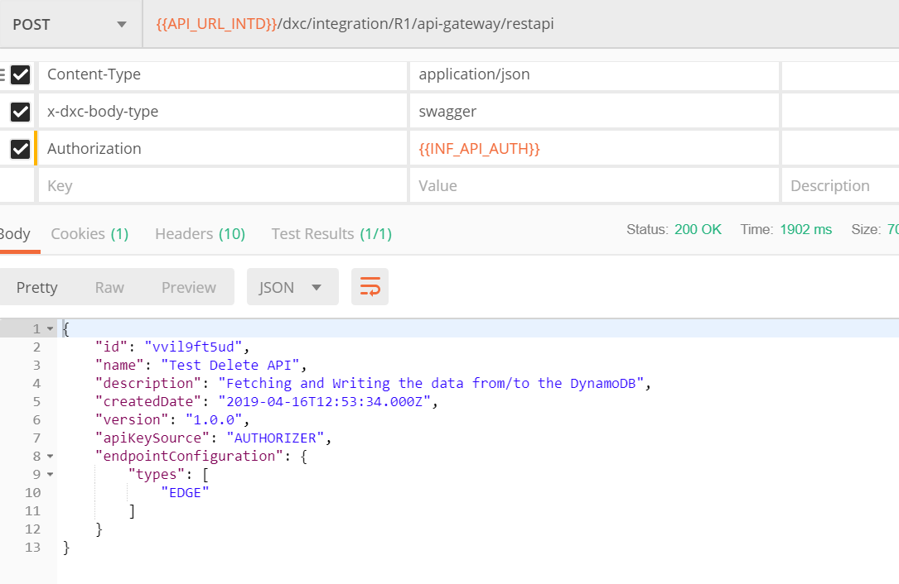
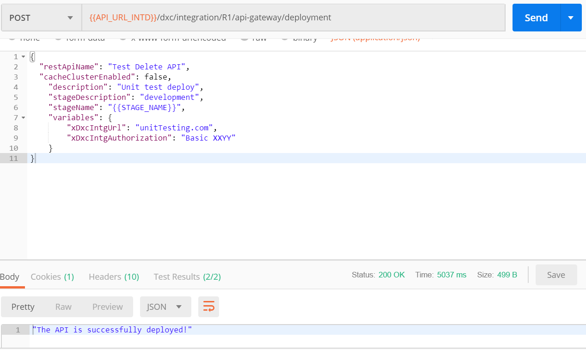
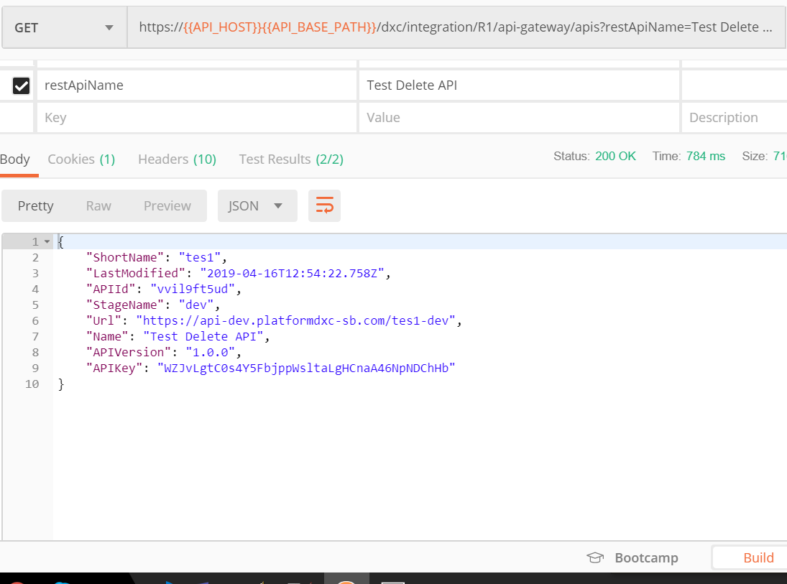
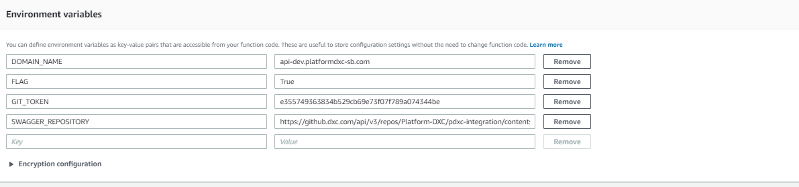
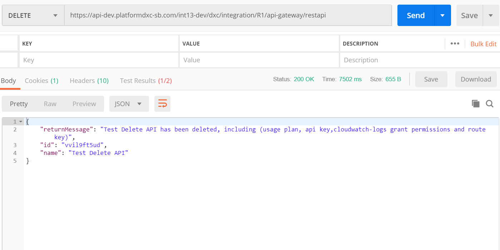
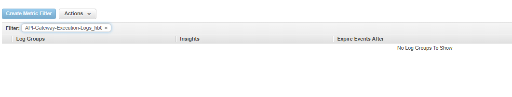
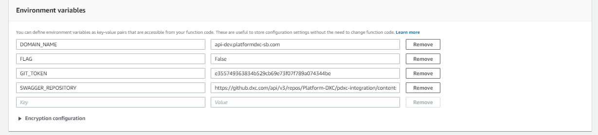
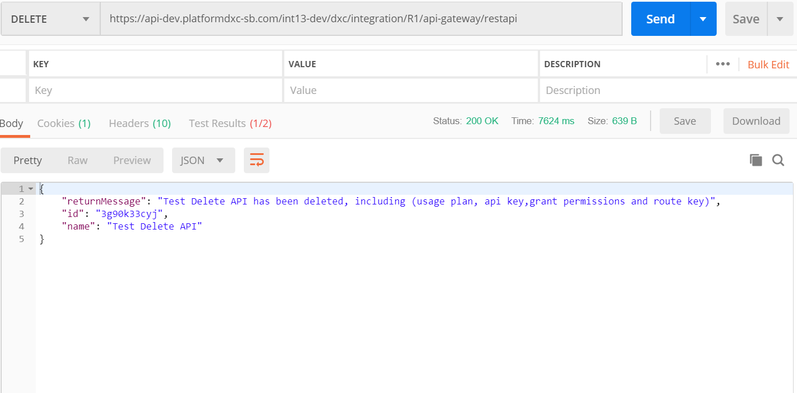
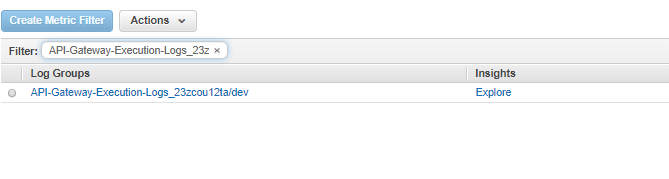

# Testing of Delete API Fucntion

## Purpose

This document provides the steps Test the Delete API.This document is intended to be followed by a person knowledgeable of Delte Api Function.

### Import the API:
Import the Test Delete API through the postman as shown below:

### Deploy the API:
Deploy the API in Ohio region through the postman as shown below:

### Get the API details:
Verify the API Present in the particular region through the postman as shown below:

### Delete the API:

>NOTE:We are using FLAG as environment variable declared in the lambda fucntion to control the deletion of cloudwatchlogs.

#### Case1:If the FLAG value is True
By default the FLAG will True,Check in AWS CONSOLE lambda fucntion:

It deletes usage plan, api key, cloudwatch logs, grant permissions and route key.As shown below:

After deletion of the API verify in AWS CONSOLE that deletion of the cloudwatchlogs.

#### Case2:If the FLAG value is False
We have to change the FLAG to False when we dont want to delete the Cloudwatchlogs as show below:

It deletes usage plan, api key, grant permissions and route key.But not the Cloudwatchlogs as shown below:

After deletion of the API verify in AWS CONSOLE that deletion of the cloudwatchlogs.

